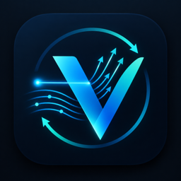
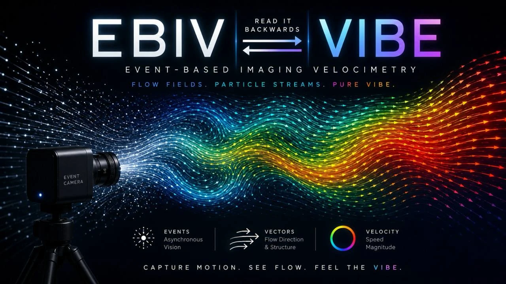

<p align="center">
  
  &nbsp;&nbsp;&nbsp;
  
</p>

# VIBEstream

**Real-time event-based imaging velocimetry (rt-EBIV) with live resolution enhancement.**

**Why VIBE?** Read *EBIV*, event-based imaging velocimetry, backwards. `VIBE` is the Python class at the core of the package; VIBEstream is everything built around it: live streaming, the offline chain, the GUI, feedback control and the resolution enhancement.

VIBEstream is for anyone who has just connected a Prophesee-sensor event camera to a PC and wants to get flow measurements out of it, without first writing their own acquisition and processing code. One parameter window, or one class for your own scripts, covers the whole path from the sensor to velocity fields:

- **Live.** Stream the scene, set the acquisition (rate, laser trigger, accumulation window, ROI) and the PIV settings, and see velocity vectors computed in real time on the pseudo-frames. Adjust and restart until the measurement looks right. The live velocity field can also drive a control loop.
- **Offline.** Follow the offline chain step by step: record a `.raw` event file, play it back, generate pseudo-images, and process them with a PIV-like multi-pass (pyramidal) correlation. Each step is a tick box in the window and the selected steps run in order. Raw files, images and velocity fields land in a fixed folder structure.
- **Resolution enhancement.** It includes the three estimators of the paper below: Kalman filter, LSE + KF, and LSE with variance rescaling + KF. Trained offline, they turn the coarse real-time field into an estimate of the high-resolution field, live.

This is an educational reference implementation, written to be read and extended. The faster C++ version is not part of this release.

> L. Franceschelli, E. Amico, C. E. Willert, M. Raiola, G. Cafiero, S. Discetti,
> *Real-Time Estimation of High-Resolution Flow Fields and Reduced-Order Coordinates from Event-Based Imaging Velocimetry*, Experiments in Fluids (2026, accepted). DOI: to be assigned.
> Data: [Zenodo](https://zenodo.org/records/20037404)

https://github.com/user-attachments/assets/ee397704-37f4-475f-b815-36d7e022fa2e

*Closed-loop control of a water jet.* VIBEstream measures the velocity field of the jet in real time. The control ROI (yellow box) is centred on the jet core, and the core velocity estimated there is the feedback signal: a PID controller sets the voltage of the pump's power supply so that the core velocity chases a user-set target. Top plot: estimated core velocity, with the target in green. Bottom plot: voltage supplied to the pump.

## Installation

1. **Camera driver.** Install the **Metavision SDK** or **OpenEB** before anything else. It is not on PyPI, so follow [Prophesee's instructions](https://docs.prophesee.ai/stable/installation/index.html). VIBEstream must run on a Python version your SDK release supports (5.x: Python 3.10–3.12; 4.6: Python 3.9).
2. **Optional: Digilent WaveForms**, only if you drive the laser trigger or the pump with an Analog Discovery.
3. **VIBEstream and all its Python packages:**

| | |
|---|---|
| **Windows** | double-click `install_windows.bat` |
| **Linux** | `bash install_linux.sh` |

The script creates a virtual environment `.venv` in this folder. It then runs `pip install -e ".[fast]"` there, and checks that NumPy, SciPy, OpenCV, h5py, Numba and Metavision can be imported. You can also do this by hand in your own environment: `pip install -e ".[fast]"`. For the optional GPU correlation, install PyTorch with CUDA from [pytorch.org](https://pytorch.org).

If the camera is not found, run `python tools/check_env.py`, then read `docs/MANUAL.txt` (DLL/plugin issues on Windows).

## Getting started

**VibeStream, the application.** Double-click `VibeStream.bat`, or run `vibestream` inside the environment. In the window you:

1. Choose what to run:
   - **Live streaming**, with a sub-mode: EBIV only, manual pump control, calibration, or closed loop.
   - **Offline chain**, with the steps you want ticked: *record .raw → play back → generate frames → offline PIV* (and *train HR model*).
2. Set the parameters on the tabs: acquisition, PIV and ROIs, offline, display. Hovering a label shows what it does, and *Validate* checks the whole configuration before anything touches the camera.
3. Press *Run*. The live stream opens its own window with the pseudo-frames and the vectors. Offline steps write to `Raw/`, `RawImg/<name>/` and `Out/<name>/` under the output folder.
4. Save the settings as a preset (*File → Save preset*) to repeat the experiment later. The last settings are restored automatically.

No camera yet? Every offline step after *record* works on any `.raw` file, for example the recordings in the [Zenodo dataset](https://zenodo.org/records/20037404). The Metavision SDK or OpenEB is still needed to read the file.

To run without the window, set the flags at the top of `EBIV_Main.py` and run that script.

**The `VIBE` class, for your own scripts** (see `VIBE_Example.py`):

```python
from vibe import VIBE

with VIBE(roi=[200, 1100, 150, 600]) as vibe:
    vibe.record(T=2, f=500, path="run01.raw")               # 2 s of events, laser at 500 Hz
    for fld in vibe.velocity(f=500, T=5, window=48, step=24):
        print(fld.t_us, fld.u.mean(), fld.v.mean())          # px/frame, v positive down
```

The class also offers a background stream for control loops (`start`, `latest`, `stop`), offline PIV on `.raw` files, and Analog Discovery control (`laser_on`, `set_voltage`, `pid`).

## Resolution enhancement

The model (POD bases + operators) can come from three places. You choose in **Resolution enhancement → Train a model…**, or with the flags in `HR_Example.py`:

1. **A recording (.raw).** LR fields are computed with the live settings; HR fields with multi-frame PIV; then the POD and operators. You get a test-block error report per estimator.
2. **LR/HR fields computed elsewhere**, e.g. `LR.mat` + `HR.mat` of a MATLAB pipeline. The POD and operators are computed here.
3. **Operators computed elsewhere.** Add one line to your MATLAB script with `tools/matlab/vibe_export_model.m`, then import the `.mat`.

For external data, the LR grid of the files must match the live grid. That match fixes the layout, orientation, scale and velocity units. Once the model is loaded, the GUI's status line shows whether the live stream is estimating HR, and refuses a model trained for other settings.

**Validation.** The port reproduces the MATLAB reference scripts (Methods I–III, run in Octave) to about 1e-14 relative. The error δ is measured against the HR field projected onto the retained modes, on test data from the same recording.

**Scope.** A model is valid only for the flow regime and processing it was trained on: no actuated or off-design flows. Variance rescaling is a heuristic.

## Tested

- **Developed and used on:** Windows 10/11; OpenEB 5.2 and 4.6; IDS uEye EVS and Prophesee EVK4 cameras (Sony IMX636 sensor); Analog Discovery 3 for the laser trigger and pump. Other IMX636 cameras with a Metavision HAL plugin should work, but are untested.
- **Automated test suites** (`tools/test_*.py`, fake camera and mocked hardware): Linux, Python 3.12. The CI runs a subset on each push.
- **Anything else is untested:** other sensors, macOS, other SDK versions.

## Repository layout

```
VibeStream.bat, EBIV_Main.py   the application (window or flag-script)
VIBE_Example.py, HR_Example.py scripting examples (flags at the top)
lib/                           the library (vibe.py = VIBE class; vibe_hr*.py, vibe_train.py,
                               vibe_import.py = resolution enhancement; ebiv_*.py = pipeline, GUI)
tools/                         tests, environment/GPU checks, MATLAB export helper
docs/MANUAL.txt                detailed manual (timing, ROIs, control loop, hardware)
```

## Citation, license, contact

If you use VIBEstream, please cite the paper above (`CITATION.cff`). The code is released under the MIT license (see `LICENSE`). Metavision SDK / OpenEB have their own licenses.

**Acknowledgements.** This project has received funding from the European Research Council (ERC) under the European Union's Horizon 2020 research and innovation programme (grant agreement No 949085, NEXTFLOW ERC StG). Views and opinions expressed are however those of the authors only and do not necessarily reflect those of the European Union or the European Research Council. Neither the European Union nor the granting authority can be held responsible for them.

Contact: Luca Franceschelli, Universidad Carlos III de Madrid, lfrances@ing.uc3m.es